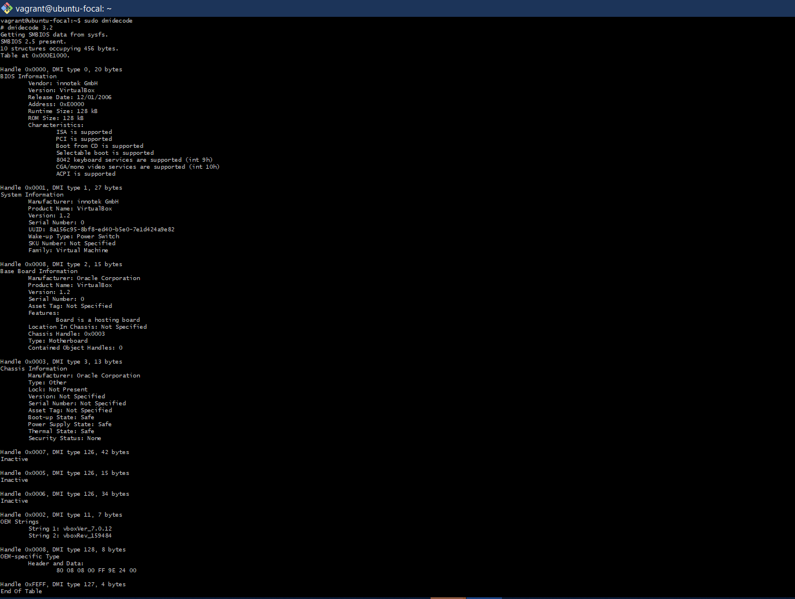
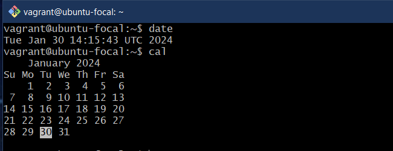
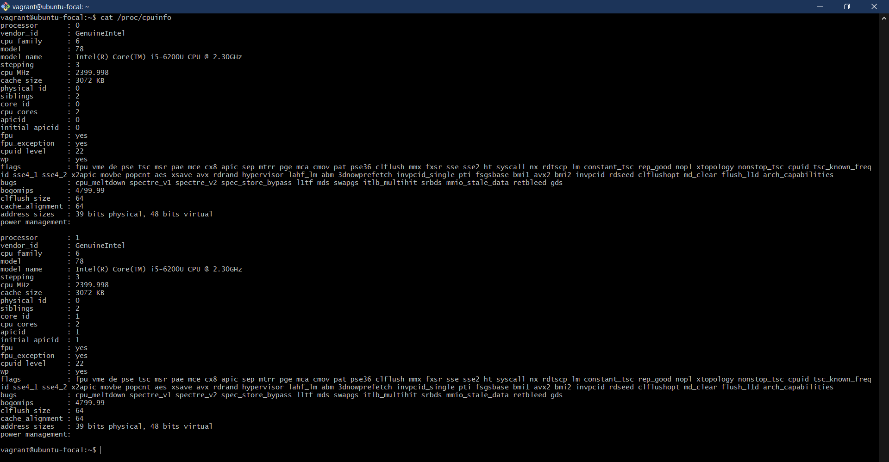
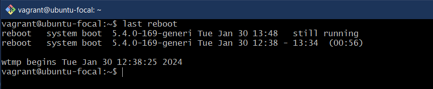
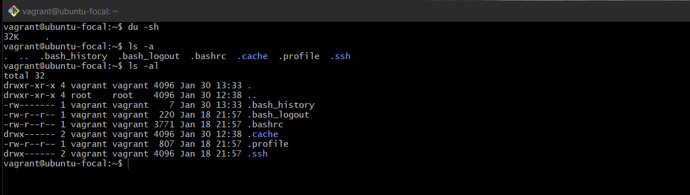
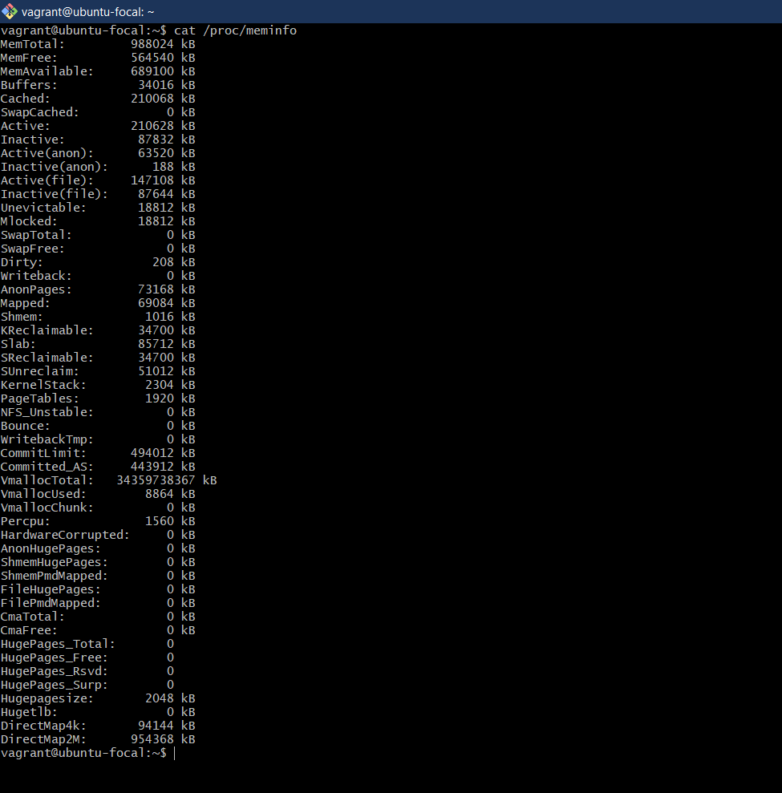
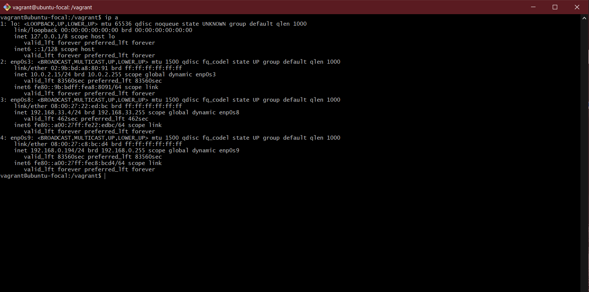
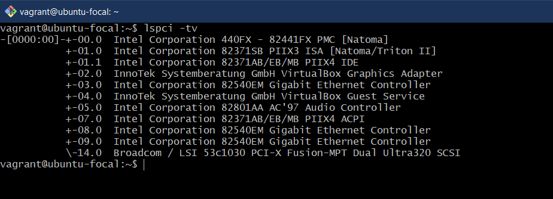
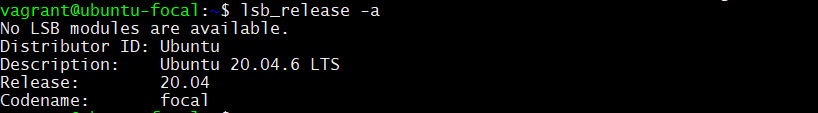
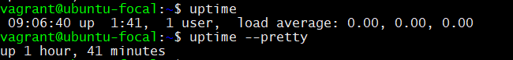

# Alt School LMS Exercise 2

The task given is to research 10 Linux commands aside the ones already mentioned in the module. Explaining what each command is used for with examples of how to use each and example screenshots of using each of them.

## Table of contents

1. [BIOS Hardware info](#bios-hardware-info)
2. [Time and Calendar](#time-and-calendar)
3. [CPU info](#cpu-info)
4. [Last System Reboot](#last-system-reboot)
5. [List all files](#list-all-files)
6. [Memory info](#memory-info)
7. [Network Interface info](#network-interface-info)
8. [PCI Devices](#pci-devices)
9. [Ubuntu Version](#ubuntu-version)
10. [Uptime](#uptime)

### BIOS Hardware info

This is used to display the BIOS hardware information. The information is fetched from **sysfs**. The command is written below as:
`sudo dmidecode`

### Time and Calendar

The `date` command displays the current time in UTC, day, month and year.

To get the calendar format, the `cal` command is used. This displays a formatted calendar type.

### CPU info

To diplay information about the CPU, including processor, vendor_id, cpu family, cpu MHz and other details. Command `cat /proc/cpuinfo`

### Last System Reboot

Command `last reboot` is used to show details about the last system reboot. It includes the time and date and the status of the system.

### List all files

To display all files/directory in a path, command `ls -al` is used. It shows a long list of all files, file permissions, users, also includes hidden files.

### Memory info

The `cat /proc/meminfo` command displays the memory information of the system.

### Network Interface info

The `ip a` displays all network interfaces IP addresses. The picture below shows all 4 network interfaces running on my vagrant machine

### PCI Devices

To display PCI Devices connected to the system, command `lspci -tv`.

### Ubuntu Version

To display the current Ubuntu version running, run `lsb_release -a`.

### Uptime

To display how long the system is up and running, the `uptime` command is used. To format it in a readable way in hours and minutes, run `uptime --pretty`. The picture below shows the the command output respectively.

